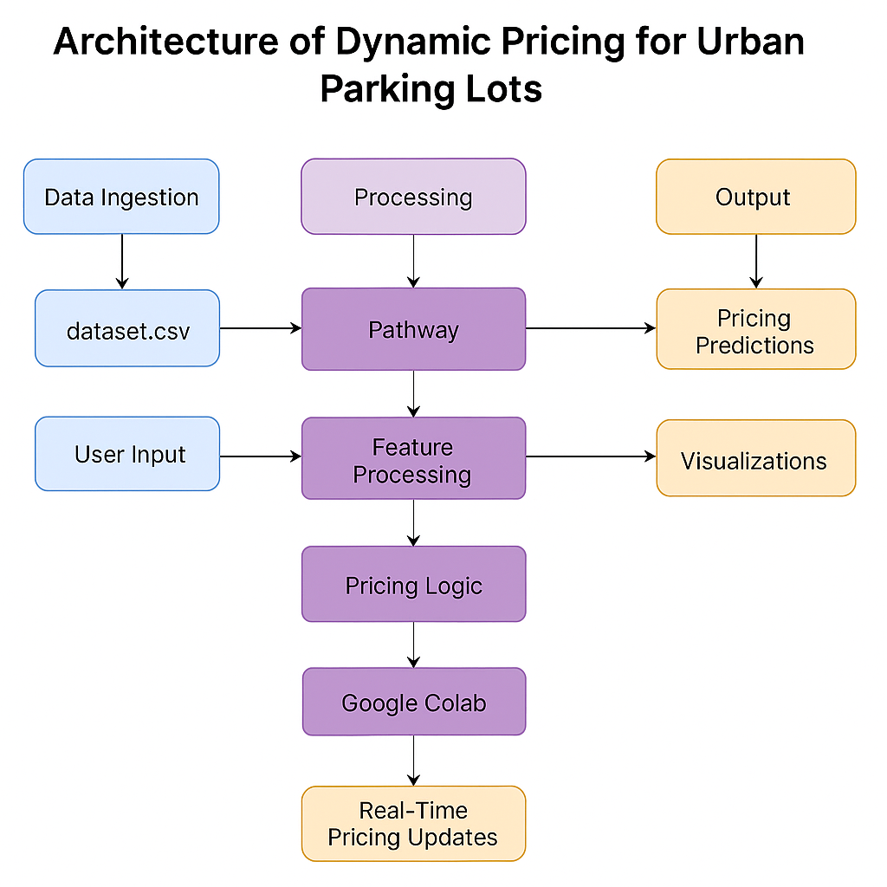
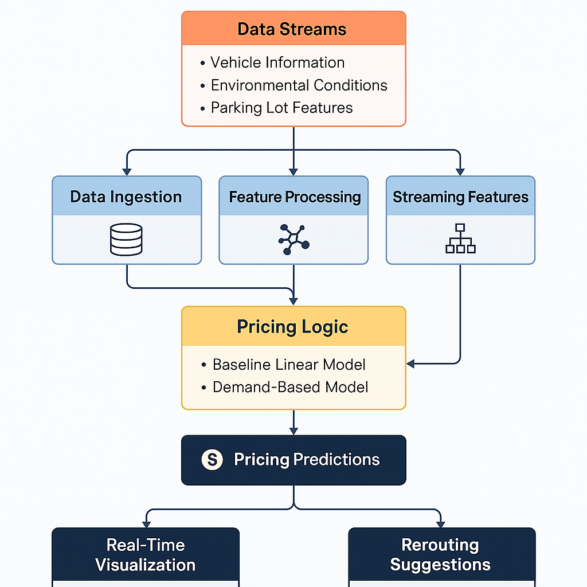

# Dynamic Pricing for Urban Parking Lots
*Capstone Project – Summer Analytics 2025*

**Author:** Jaiby Mariya Joseph

---

## Overview
Urban parking spaces often suffer from inefficiencies caused by static pricing. This project builds a **real-time dynamic pricing engine** for 14 parking spaces using demand factors such as:
- Occupancy
- Traffic congestion
- Queue length
- Vehicle type
- Special day indicators
- Competitor pricing (optional)

The solution ensures smooth, explainable, and adaptive pricing over time, leveraging real-time data streaming with Pathway and interactive Bokeh visualizations.

---

## Tech Stack
- **Python** (Data Processing & ML logic)
- **NumPy / Pandas** (data transformation)
- **Pathway** (real-time data simulation)
- **Bokeh & Panel** (interactive visualizations)
- **Matplotlib** (static plots for documentation)
- **FPDF** (PDF generation for reporting)

---

## Architecture Diagram


---

## Workflow Explanation


---

## Architecture Explanation
The architecture is designed to handle real-time data ingestion, process important features, compute dynamic pricing, and deliver predictions/visualizations in real time. The architecture follows modular layers:

1. Data Streams Layer
This is the raw input layer that feeds the system with historical and real-time data. The data comes from:

Vehicle information (type, entry time)

Environmental conditions (traffic, special day)

Parking lot features (capacity, queue, location)

These inputs are read from a CSV or simulated real-time stream via Pathway.

2. Data Ingestion & Preprocessing
Using Pathway, the system ingests timestamped records in real-time. This step:

Parses dates/times into Timestamp

Maps vehicle types and traffic levels into numerical weights

Normalizes capacity and occupancy values

Detects special events or peak periods

Tools Used: Pandas, NumPy, Pathway (for real-time simulation)

3. Feature Processing Layer
This layer transforms raw inputs into useful, engineered features:

Occupancy Ratio = Occupancy / Capacity

Vehicle Weight = Car (1.0), Bike (0.5), Truck (1.5)

Traffic Weight = Low (0.5), Medium (1.0), High (1.5)

One-hot encoding for categorical fields (optional)

The enriched features feed into pricing models downstream.

4. Pricing Logic Engine
This is the core module of the project and includes multiple models:

Model 1 (Baseline Linear):

Price increases linearly with occupancy ratio.

Price(t+1) = Price(t) + α × (Occupancy / Capacity)

Model 2 (Demand-Based):

Uses multiple features to compute a demand score.

Price = Base × (1 + λ × NormalizedDemand)

Demand formula includes queue, traffic, special events, and vehicle type.

Model 3 (Optional - Competitive):

Analyzes competitor lot prices (using latitude/longitude proximity).

Adjusts pricing if nearby lots are cheaper or full.

5. Streaming & Real-Time Prediction
Processed data and pricing logic are streamed using Pathway:

Real-time pricing is computed and updated continuously.

Smooth transitions are ensured by clamping price ranges to [$10, $20].

6. Output Layer: Visualization & Suggestions
The final outputs are:

Real-time Bokeh dashboards (daily price trends)

Rerouting suggestions if a lot is full or congested

PDF reports and pricing predictions

This makes the pricing transparent and explainable for both city operators and users.
--

##Workflow Summary
Collect real-time and historical data

Preprocess and normalize inputs

Engineer features like traffic, queue, vehicle type

Compute pricing using selected models

Stream predictions continuously via Pathway

Visualize with Bokeh and provide rerouting advice
---

## Structure
```
├── dataset (1).csv              # Main dataset (73 days, 18 samples/day)
├── full_dynamic_pricing_code.py # Complete source code
├── Dynamic_Pricing_Final_Report_With_Outputs_Visuals.pdf # Final report
├── architecture_diagram.png     # Architecture diagram (to be generated)
├── workflow_diagram.png         # Workflow explanation diagram (to be generated)
└── README.md                    # Project readme file
```

---

##  How to Run
1. Clone the repo and place the dataset in the same directory.
2. Run the Python script (`full_dynamic_pricing_code.py`).
3. Make sure `pw.run()` is uncommented for real-time processing.
4. Outputs will be visualized using Bokeh and Panel.

---

##  Output Highlights
- Dynamic prices range from **$10 to $20** depending on demand.
- Real-time adaptation to vehicle type, traffic, and events.
- Rerouting logic can be built into Model 3 (proximity-aware pricing).
